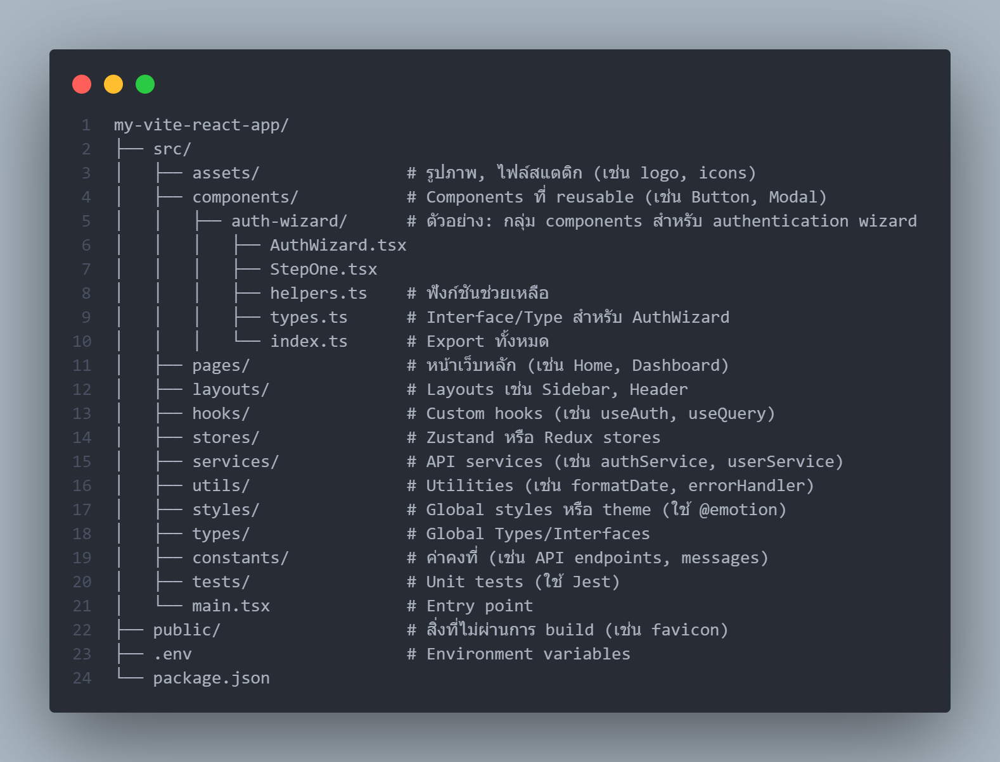

# React + TypeScript + Vite

This template provides a minimal setup to get React working in Vite with HMR and some ESLint rules.

Currently, two official plugins are available:

- [@vitejs/plugin-react](https://github.com/vitejs/vite-plugin-react/blob/main/packages/plugin-react/README.md) uses [Babel](https://babeljs.io/) for Fast Refresh
- [@vitejs/plugin-react-swc](https://github.com/vitejs/vite-plugin-react-swc) uses [SWC](https://swc.rs/) for Fast Refresh

## Expanding the ESLint configuration

If you are developing a production application, we recommend updating the configuration to enable type-aware lint rules:

```js
export default tseslint.config({
  extends: [
    // Remove ...tseslint.configs.recommended and replace with this
    ...tseslint.configs.recommendedTypeChecked,
    // Alternatively, use this for stricter rules
    ...tseslint.configs.strictTypeChecked,
    // Optionally, add this for stylistic rules
    ...tseslint.configs.stylisticTypeChecked,
  ],
  languageOptions: {
    // other options...
    parserOptions: {
      project: ['./tsconfig.node.json', './tsconfig.app.json'],
      tsconfigRootDir: import.meta.dirname,
    },
  },
})
```

You can also install [eslint-plugin-react-x](https://github.com/Rel1cx/eslint-react/tree/main/packages/plugins/eslint-plugin-react-x) and [eslint-plugin-react-dom](https://github.com/Rel1cx/eslint-react/tree/main/packages/plugins/eslint-plugin-react-dom) for React-specific lint rules:

```js
// eslint.config.js
import reactX from 'eslint-plugin-react-x'
import reactDom from 'eslint-plugin-react-dom'

export default tseslint.config({
  plugins: {
    // Add the react-x and react-dom plugins
    'react-x': reactX,
    'react-dom': reactDom,
  },
  rules: {
    // other rules...
    // Enable its recommended typescript rules
    ...reactX.configs['recommended-typescript'].rules,
    ...reactDom.configs.recommended.rules,
  },
})
```

--------------------------------------------------------------------------------------------------------------------------------------------------

# Vite Command

1. `npm run dev` = start app for dev (localhost)
2. `npm run build` = build to production
3. `npm run build:staging` = build to staging (test)
4. `npm run preview` = start app on dist after build for preview (localhost)
5. `npm run test` = start vitest
6. `npx vitest --ui` = start vitest (ui)

--------------------------------------------------------------------------------------------------------------------------------------------------

# Jenkinsfile Config

1. Deploy to IIS : Change mode "production" or "staging" for deploy to web server
2. ??? Set case git private
3. ??? Set jenkins for production server

--------------------------------------------------------------------------------------------------------------------------------------------------

# React Project Development Policy

## Project Structure

The React project structure is designed to be modular, scalable, and easy to maintain, using Vite as the build tool and TypeScript for type safety. The basic structure is as follows:



> **Reason**: This structure separates the responsibilities of each part (Separation of Concerns) and allows the team to collaborate efficiently. Using clearly named folders and an organized structure reduces complexity as the project grows.

## Explanation of Responsibilities, File Naming, and Examples for Each Folder in the Project

1. **assets/**  
   - **Responsibility**: Stores static files such as images, icons, or fonts used in the project.
   - **Naming**: Use lowercase with dashes (e.g., `logo-dark.png`, `icon-user.svg`).
   - **Examples**: `background-image.jpg`, `app-icon.ico`.
2. **components/**  
   - **Responsibility**: Stores reusable components such as buttons, modals, or sub-forms.
   - **Naming**: Use PascalCase for component files (e.g., `Button.tsx`) and lowercase with dashes for folders (e.g., `auth-wizard/`). Always use named exports.
   - **Examples**: 
     - Folder: `auth-wizard/`
     - Files: `AuthWizard.tsx`, `LoginForm.tsx`, `helpers.ts`, `types.ts`.
3. **pages/**  
   - **Responsibility**: Stores main application pages (e.g., Home, About, Dashboard), which often consist of multiple components.
   - **Naming**: Use PascalCase and names that reflect the page's purpose (e.g., `HomePage.tsx`, `DashboardPage.tsx`).
   - **Examples**: `UserProfilePage.tsx`, `SettingsPage.tsx`.
4. **layouts/**  
   - **Responsibility**: Stores commonly used layouts such as Sidebar, Header, Footer.
   - **Naming**: Use PascalCase (e.g., `SidebarLayout.tsx`).
   - **Examples**: `MainLayout.tsx`, `AuthLayout.tsx`.
5. **hooks/**  
   - **Responsibility**: Stores custom hooks for reusable logic (e.g., `useAuth`, `useForm`).
   - **Naming**: Use camelCase starting with `use` (e.g., `useAuth.ts`, `useQueryData.ts`).
   - **Examples**: `useUserData.ts`, `useThemeToggle.ts`.
6. **stores/**  
   - **Responsibility**: Stores state management logic (e.g., Zustand, Redux).
   - **Naming**: Use camelCase and domain-specific names (e.g., `userStore.ts`, `authStore.ts`).
   - **Examples**: `globalStateStore.ts`, `cartStore.ts`.
7. **services/**  
   - **Responsibility**: Handles API calls or application-level logic (e.g., `authService`, `userService`).
   - **Naming**: Use camelCase (e.g., `authService.ts`, `apiClient.ts`).
   - **Examples**: `paymentService.ts`, `dataFetchService.ts`.
8. **utils/**  
   - **Responsibility**: Stores utility functions unrelated to business logic (e.g., format date, validate email).
   - **Naming**: Use camelCase (e.g., `formatDate.ts`, `logger.ts`).
   - **Examples**: `errorHandler.ts`, `stringUtils.ts`.
9. **styles/**  
   - **Responsibility**: Stores global styles, themes, or CSS-in-JS (using @emotion).
   - **Naming**: Use camelCase (e.g., `theme.ts`, `globalStyles.ts`).
   - **Examples**: `colors.ts`, `typography.ts`.
10. **types/**  
    - **Responsibility**: Stores TypeScript interfaces and types commonly used in the project.
    - **Naming**: Use camelCase (e.g., `userTypes.ts`, `apiResponseTypes.ts`).
    - **Examples**: `authTypes.ts`, `uiTypes.ts`.
11. **constants/**  
    - **Responsibility**: Stores constants such as API endpoints, error messages.
    - **Naming**: Use UPPER_CASE_WITH_UNDERSCORES (e.g., `API_ENDPOINTS.ts`, `ERROR_MESSAGES.ts`).
    - **Examples**: `ROLES.ts`, `STATUS_CODES.ts`.
12. **tests/**  
    - **Responsibility**: Stores unit tests and integration tests (using Jest).
    - **Naming**: File names should end with `.test.ts` and mirror the name of the file being tested (e.g., `Button.test.ts` for `Button.tsx`).
    - **Examples**: `AuthWizard.test.ts`, `useAuth.test.ts`.

## Best Practices for Naming Variables and Functions in Each Case

Naming in React/TypeScript should be clear, meaningful, and consistent with the following conventions:

1. **Variables**:  
   - Always use **camelCase** (e.g., `isLoading`, `userData`).
   - Use prefixes that indicate status or type (e.g., `is`, `has`, `should` for booleans; `get`, `set` for functions).
   - **Examples**: 
     - Boolean: `isAuthenticated`, `hasError`.
     - Objects/Arrays: `userList`, `formData`.
     - Functions: `getUserData`, `setLoadingState`.
2. **Functions**:  
   - Use **camelCase** and names that are verb + noun (e.g., `fetchUsers`, `validateForm`).
   - For pure functions, use the `function` keyword instead of `const` (per rules).
   - **Examples**: 
     - `function formatDate(date: Date): string { ... }`
     - `function handleSubmit(event: React.FormEvent): void { ... }`
3. **Components**:  
   - Use **PascalCase** and names that describe the component's purpose (e.g., `UserProfile`, `LoginForm`).
   - **Examples**: 
     - `function UserProfile({ user }: UserProps) { ... }`
     - `export function AuthWizard() { ... }`
4. **Files and Folders**:  
   - Use **lowercase** with dashes for folders (e.g., `auth-wizard`) and PascalCase for component files (e.g., `AuthWizard.tsx`).
   - **Examples**: `src/components/button/Button.tsx`, `src/pages/dashboard/DashboardPage.tsx`.
5. **Constants**:  
   - Use **UPPER_CASE_WITH_UNDERSCORES** (e.g., `MAX_USERS`, `API_BASE_URL`).
   - **Examples**: `ERROR_NOT_FOUND = 'Resource not found'`.
6. **Types/Interfaces**:  
   - Use **PascalCase** and names that describe the data structure (e.g., `User`, `ApiResponse`).
   - **Examples**:
     ```ts
     interface User {
       id: number;
       name: string;
       isActive: boolean;
     }
     ```
7. **Hooks**  
    - Start with `use` and use camelCase (e.g., `useAuth`, `useFormState`).
    - **Examples**:
      ```ts
      function useAuth(): { isLoggedIn: boolean; login: () => void } {
        // Logic here
      }
      ```
8. **Event Handlers**  
    - Start with `handle` and describe the action (e.g., `handleClick`, `handleChange`).
    - **Examples**:
      ```ts
      function handleSubmit(event: React.FormEvent) {
        event.preventDefault();
        // Submit logic
      }
      ```